<div align="center">


#  apolo agradece ter clicado no meu perfil! 


<br/>


<br/>

[](https://www.linkedin.com/in/kyliesantosdev/)
[](mailto:kyliewilliam.ads@gmail.com)
[](https://instagram.com/kyliecyan)
[](https://github.com/kyliews)
[](https://arquivotransformista.com.br/)


</div>

---

##  `$ whoami`

```diff
+ AI Engineer | Full Stack | Segurança da Informação
+ Mulher trans, nordestina e periférica
+ Construindo tecnologia que inclui, protege e transforma realidades
+ Mãe do Apolo 🐕 | Nerd de hardware | Data for Social Equity 
```

Sou engenheira de IA focada em resolver problemas **reais** — principalmente onde ninguém tá olhando.

Construo sistemas com:

-  **Arquiteturas Agentic** — orquestração multi-agentes em produção
-  **RAG (LLMs + dados reais)** — recuperação semântica e pipelines de embeddings
-  **Segurança + LGPD** — privacidade por design, conformidade e proteção de dados
-  **Dados para políticas públicas** — evidências científicas para ESG e governança
-  **Data for Social Equity** — minha filosofia, meu propósito

---

##  `$ impact --quick`

```yaml
processo_otimizado:   "1h → < 5 minutos com IA"
dados_processados:    "+150.000 registros analisados"
hackathon:            " 1º lugar HackaPride 2025 (UFPE/CITi)"
observatorio:         "DiversificaData lançado na Fiocruz/RJ (mar/2026)"
certificacoes:        "AZ-400 | AI-900 | Generative AI (Microsoft)"
```

---

##  `$ jobs --current`

###  iFood (iFood Pago / Zoop) — AI Engineer Intern
**abr/2026 – presente | Híbrido**

- Evolução e sustentação de **arquitetura de agentes de IA** na fintech do iFood
- Escalabilidade de sistemas agentéticos e refinamento de **pipelines RAG** para suporte à decisão em tempo real
- Analytics e dashboards para o time de Customer Experience

**Summer Job – AI Agents** `dez/2025 – mar/2026`
- Reduzi tempo de análise de processos críticos de **1h → < 5 minutos** (LangChain + RAG)
- Processamento massivo com **Spark SQL + Databricks**
- Atuação em prevenção a fraudes, compliance e proteção de dados sensíveis

---

###  DiversificaDev — Diretora Institucional & de Inteligência de Dados
**abr/2026 – presente | Remoto**

- Participação Estratégica no **DiversificaData** (Observatório Nacional da Comunidade Trans) em parceria com **Fiocruz/ENSP**
- Gestão de arquitetura de dados, IA ética e soluções com **privacidade por design** (TransEmpregos)
- Articulação com parlamentares, órgãos públicos e empresas para capacitação inclusiva e proteção digital

**Voluntária – Articulação Institucional** `fev/2026 – mar/2026`
- Conexão estratégica com Fiocruz/ENSP e órgãos públicos para políticas de inclusão tecnológica

##  `$ projects --highlight`

###  TRO.IA — ` 1º lugar HackaPride 2025 (CITi/UFPE)`
> IA que transforma câmeras escolares em sistemas de cuidado preventivo — detecta padrões de risco de evasão e violência silenciosa. Arquitetura técnica e liderança total.

###  DiversificaData — `Fiocruz/ENSP`
> Observatório nacional que produz evidências científicas para desmontar o "Paradoxo da Qualificação" e subsidiar estratégias de ESG e governança corporativa.
> Lançado em 31 de março de 2026 na Fiocruz/RJ — com atuação como host do evento.

###  TransEmpregos
> Sistema RAG + agentes que conecta pessoas trans a vagas — indexação vetorial, orquestração multi-agentes, anonimização e privacidade por design (LGPD).

###  Arquivo Transformista — [`arquivotransformista.com.br`](https://arquivotransformista.com.br/)
> Plataforma de memória da arte transformista em SP. Tradução de design Figma → WordPress responsivo e acessível.

###  Mentoria HackGirls 2025.2 (Fiocruz)
> Coordenação geral do eixo de Tecnologia e Prototipagem — letramento digital, IA, IoT e Blockchain para meninas e mulheres.


##  `$ stack --full`

###  IA & Dados


###  Backend & Segurança


### Cloud & DevOps


###  Bancos de Dados & Vetoriais


###  Frontend


---

##  `$ education`

| Curso | Instituição | Status |
|-------|-------------|--------|
| Tecnólogo em Segurança da Informação | CESAR School |  Em andamento (dez/2027) |
| Bacharelado em Engenharia de Software | Faculdade Damas | 2024–2025 |
| Curso de Aperfeiçoamento em Python (156h) | SENAC Porto Digital |  Concluído jan/2024 |

---

##  `$ certifications`

-  **Microsoft Certified:** Azure DevOps Engineer Expert **(AZ-400)** — 2026
-  **Microsoft Certified:** Azure AI Fundamentals **(AI-900)** — 2026
-  **Artificial Intelligence & Generative AI** (Microsoft / Azure ML / Databricks) — 2025
-  **Soft Skills iFood** — Código de Ética, PLD, Segurança da Informação — 2025
-  **Gestão Ágil com Scrum e Kanban** — Senac Brasil — 2025
-  **1º lugar HackaPride 2025** — CITi/UFPE (TRO.IA)
-  **3º lugar InovaPride 2025**
-  **Elas na IA** — WoMakersCode (30h) — 2025

 [Ver todas no LinkedIn](https://www.linkedin.com/in/kyliesantosdev/details/certifications/)

---

##  `$ social_impact`

| Iniciativa | Onde | Quando |
|-----------|------|--------|
|  Host & Apresentadora – Lançamento DiversificaData | Fiocruz/RJ | mar/2026 |
|  Mentora – LinkedIn Estratégico (Carreta Digital) | Pajubá Tech | fev/2026 |
|  Coordenadora Tecnologia – HackGirls 2025.2 | Fiocruz | 2026.1 |
|  Monitora – Oficina Low-Code | Senac Pernambuco | out/2025 |

---

##  `$ languages`


---

##  `$ recommendations`

> *"Responsabilidade, atenção aos detalhes e visão crítica no desenvolvimento digital."*
>
> — **Cristiane de Araujo Ferreira**, People Analytics

 [Ver no LinkedIn](https://www.linkedin.com/in/kyliesantosdev/#recommendations)

---

##  `$ differentials`

```python
kylie = {
    "velocidade":    "ideia → produção no menor tempo possível",
    "pensamento":    "sistêmico, não só código",
    "impacto":       "IA aplicada onde mais importa",
    "diplomacia":    "traduz arquitetura complexa para stakeholders e governo",
    "identidade":    "mulher trans, nordestina, periférica — e isso é diferencial",
}
```

---

##  `$ stats`

<div align="center">

<!-- Card de Estatísticas Gerais -->


<picture>
  <source srcset="https://streak-stats.demolab.com?user=kyliews&theme=radical&hide_border=true" media="(prefers-color-scheme: dark)" />
  <source srcset="https://streak-stats.demolab.com?user=kyliews&theme=default&hide_border=true" media="(prefers-color-scheme: light)" />
  
</picture>

  <!-- Card de Linguagens Mais Usadas -->



</div>

---

##  `$ contributions --snake`

<div align="center">


</div>

---

##  `$ philosophy`

```
tecnologia não é neutra.

ou ela reproduz desigualdade —
ou ela corrige.

eu escolhi corrigir.
```

---

<div align="center">


<br/><br/>

 *se chegou até aqui, bora construir algo absurdo juntos.* 

<br/>

[](https://www.linkedin.com/in/kyliesantosdev/)

</div>

> se você leu até aqui:
>  provavelmente a gente deveria trabalhar junto.
>  👉 kyliewilliam.ads@gmail.com


